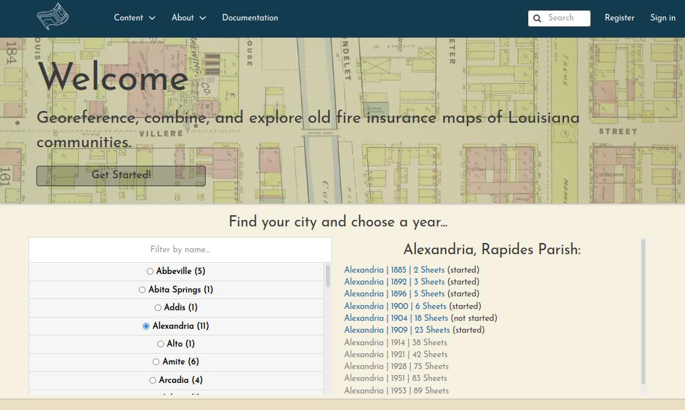
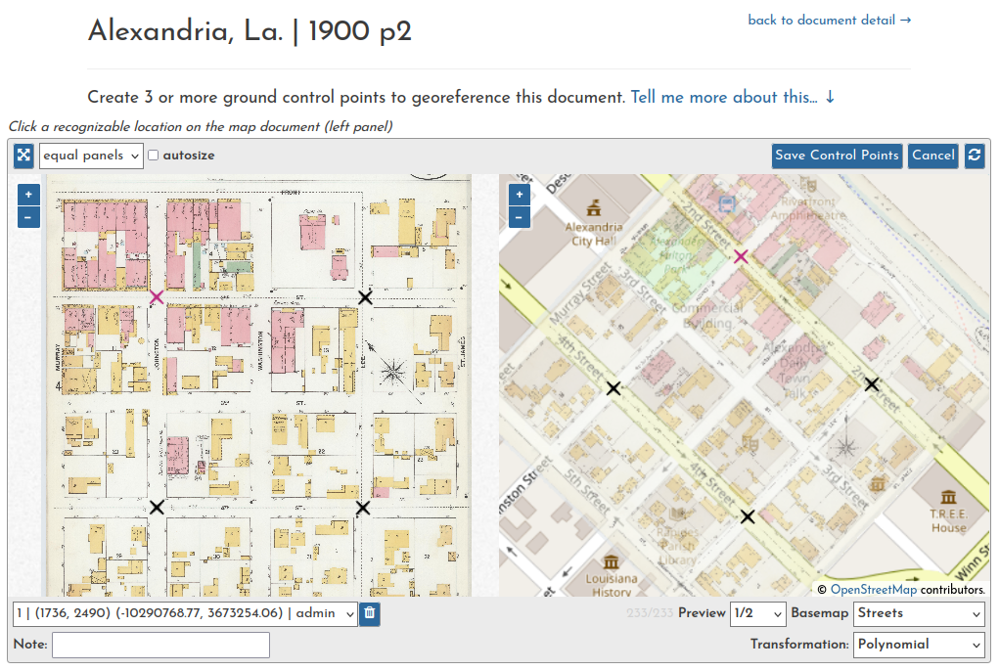
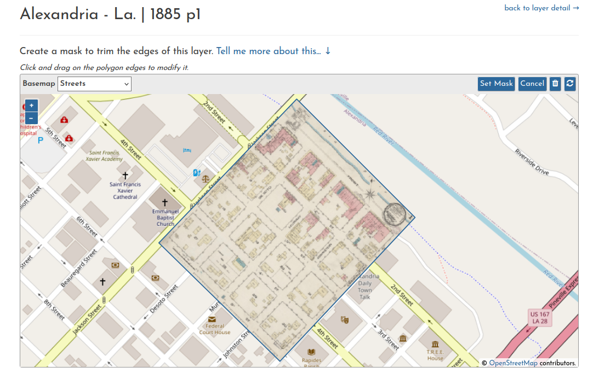

# Louisiana Historical Map Georeferencer (LaHMG)

This app is a customized deployment of [GeoNode](https://geonode.org), built from [geonode-project](https://github.com/GeoNode/geonode-project). It is a crowdsourcing platform for georeferencing maps of Louisiana from the Library of Congress [Sanborn Maps Collection](https://loc.gov/collections/sanborn-maps).

- **Main Site:** [oldinsurancemaps.net](https://oldinsurancemaps.net)
- **Documentation:** [docs.oldinsurancemaps.net](https://docs.oldinsurancemaps.net)

---

You can browse volumes of fire insurance maps from the home page.

---

Each volume's summary page has an interactive Map Overview showing all of the sheets that have been georeferenced so far.

Each volume's summary page also lists the progress and georeferencing stage of each sheet.

---

The georeferencing process generally consists of three operations.

Document preparation (sometimes they must be split into multiple pieces):

Ground control point creation (these are used to warp the document into a geotiff):

Trimming the edges off of a layer (optional, useful for handling overlapping sheets):

---

Please don't hesitate to [open a ticket](https://github.com/mradamcox/loc-insurancemaps/issues/new/choose) if you have trouble with the site or find a bug.
