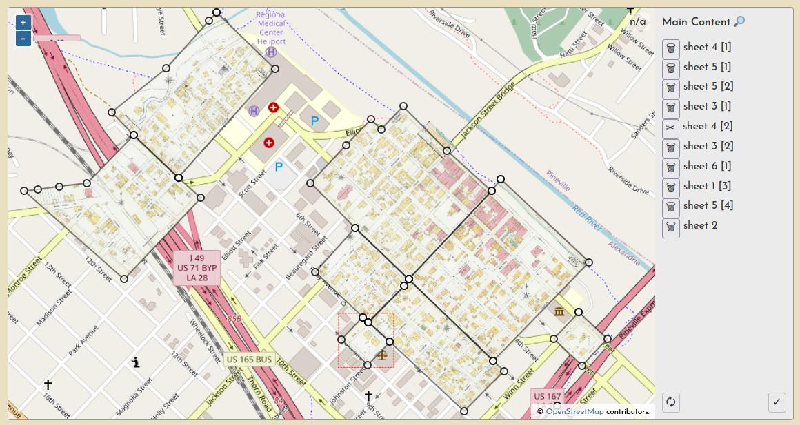

# Online Historical Map Georeferencer (OHMG)

OHMG is a web application that facilitates public participation in the process of georeferencing and mosaicking historical maps. This is a standalone project that requires an external instance of [Titiler](https://developmentseed.org/titiler) to serve the mosaicked layers. See Dependencies below for more about the tech stack.

At present, the system is structured around the Sanborn Map Collection at the Library of Congress ([loc.gov/collections/sanborn-maps](https://loc.gov/collections/sanborn-maps)). More generic ingestion methods are in the works.

- **Implementation:** [oldinsurancemaps.net](https://oldinsurancemaps.net)
- **Documentation:** [ohmg.dev](https://ohmg.dev)

---

Please don't hesitate to [open a ticket](https://github.com/mradamcox/loc-insurancemaps/issues/new/choose) if you have trouble with the site, find a bug, or have suggestions otherwise.

---

## Site Overview

You can browse content in the platform by map, by place name, or by item name.


Each volume's summary page has an interactive Map Overview showing all of the sheets that have been georeferenced so far.


Each volume's summary page also lists the progress and georeferencing stage of each sheet.


Finally, each resource itself has it's own page, showing a complete lineage of the work that has been performed on it by various users.

![Alexandria, La, 1900, p1 [2]](./ohmg/frontend/static/img/example-resource-alex-1900.jpg)

## Process Overview

The georeferencing process generally consists of three operations, each with their own browser interface.

Document preparation (sometimes they must be split into multiple pieces):


Ground control point creation (these are used to warp the document into a geotiff):


And a "multimask" that allows a volume's sheets to be trimmed *en masse*, a quick way to create a seamless mosaic from overlapping sheets:



Learn much more about each step [in the docs](https://ohmg.dev/docs/category/making-the-mosaics-1).

All user input is tracked through registered accounts, which allows for a comprehensive understanding of user engagement and participation, as well as a complete database of all input georeferencing information, like ground control points, masks, etc.

## Software Details

This is a Django project, with a frontend built (mostly) with [Svelte](https://svelte.dev), using [OpenLayers](https://openlayers.org) for all map interfaces. OpenStreetMap and Mapbox are the basemap sources.

### Third-party Django Apps

- [Django Ninja](https://django-ninja.rest-framework.com) - API
- [Django Newsletter](https://github.com/jazzband/django-newsletter) - Newsletter (optional feature)

### External Dependencies

- Postgres/PostGIS
- Celery + RabbitMQ
- GDAL >= 3.5
- [TiTiler](https://developmentseed.org/titiler)

## Development Installation

Running the application requires a number of components to be installed and configured properly. This aspect of the application is not optimized, but getting it documented is the first step.

### Create database

Install Postgres/PostGIS as you like. Once running, create a database like this

```bash
psql -U postgres -c "CREATE USER ohmg WITH ENCRYPTED PASSWORD '$DB_PASSWORD'"
psql -U postgres -c "CREATE DATABASE oldinsurancemaps WITH OWNER ohmg;"
psql -U postgres -d oldinsurancemaps -c "CREATE EXTENSION PostGIS;"
```

See also `./scripts/create_database.sh`.

### Install Django project

Make virtual env

```bash
python3 -m venv env
source env/bin/activate
```

Install Python deps

```bash
git clone https://github.com/mradamcox/ohmg && cd ohmg
pip install -r requirements.txt
```

Set environment variables

```bash
cp .env.original .env
```

Initialize database, create admin user

```bash
python manage.py migrate
python manage.py createsuperuser
```

Load all the place objects to create geography scaffolding

```bash
python manage.py place import-all
```

### Build frontend

The frontend uses a suite of independently built svelte components.

```bash
cd ohmg/frontend/svelte
pnpm install
pnpm run dev
```

### Run Django dev server

You can now run

```bash
python manage.py runserver
```

and view the site at `http://localhost:8000`.

However, few more components will need to be set up independently before the app will be fully functional. Complete the following sections and then rerun the dev server so that any new `.env` values will be properly aqcuired.

### Rabbit + Celery

In development, RabbitMQ can be run via Docker like so:

```bash
docker run --name rabbitmq --hostname my-rabbit \
  -p 5672:5672 \
  -p 15672:15672 \
  -e RABBITMQ_DEFAULT_USER=username \
  -e RABBITMQ_DEFAULT_PASS=password \
  --rm \
  rabbitmq:3-alpine
```

For convenience, this command is in the following script:

```bash
source ./scripts/rabbit_dev.sh
```

Once RabbitMQ is running, update `.env` with the `RABBITMQ_DEFAULT_USER` and `RABBITMQ_DEFAULT_PASS` credentials you used above when creating the container.

Now you are ready to run Celery in development with:

```bash
source ./scripts/celery_dev.sh
```

### TiTiler

TiTiler can also be run via Docker, using a slightly modified version of the official container (it is only modified to include the WMS endpoint extension):

```bash
docker run --name titiler \
  -p 8008:8000 \
  -e PORT=8000 \
  -e MOSAIC_SCRIPT_ZOOM=False \
  -e WORKERS_PER_CORE=1 \
  --rm \
  -it \
  ghcr.io/mradamcox/titiler:0.11.6-ohmg
```

Or the same command is wrapped in:

```bash
source ./scripts/titiler_dev.sh
```

This will start a container running TiTiler and expose it to `localhost:8008`.

Make sure you have `TITILER_HOST=http://localhost:8008` in `.env`.

### Nginx

One hitch during development is that the Django dev server [does not serve range requests](https://code.djangoproject.com/ticket/22479), meaning that TiTiler will need to be fed urls to local files that are running behind Apache or Nginx, not just the Django dev server.

```bash
sudo apt install nginx
```

Once nginx is running, make sure the default server config includes an alias that points directly to the same directory that your Django app will use for `MEDIA_ROOT`.

`/etc/nginx/sites-enabled/default`

```bash
server {
    ...
    location /uploaded {
        alias /home/ohmg/uploaded;
    }
    ...
}
```

Finally, make sure that the following environment variables are set, `MEDIA_HOST` being a prefix that is appended to any uploaded media paths that are passed to TiTiler.

`.env`

```bash
MEDIA_HOST=http://localhost
MEDIA_ROOT=/home/ohmg/uploaded
```

In production, you will already be using Nginx, so these steps would be redundant. If there is no `MEDIA_ROOT` environment variable set locally, it will default to `SITEURL`.
