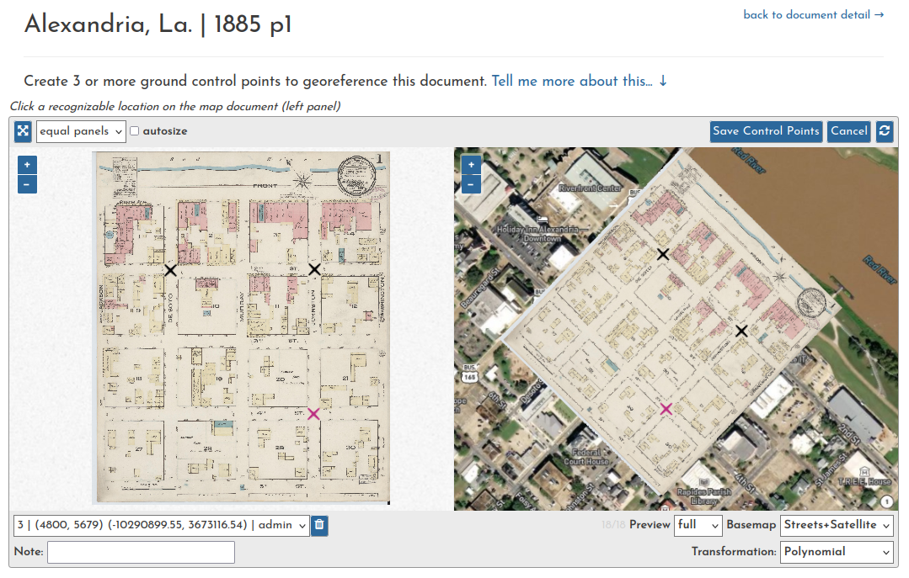

# Tech Overview

Technologically, this platform is the result of a few layered applications.

1. [GeoNode](https://geonode.org) - an open source geospatial content management system<br>
   Components include: [Django](https://django.org) &#8226;
   [GeoServer](https://geoserver.org) &#8226;
   [PostgreSQL](https://postgresql.org)/[PostGIS](https://postgis.net) &#8226;
   [OpenLayers](https://openlayers.org)
2. A [Georeference](#the-georeference-app) app - handles all of the georeferencing operations<br>
   Dependencies added: [MapServer](https://mapserver.org) &#8226;
   [Svelte](https://svelte.dev)
3. A [LOC Insurance Maps](#the-loc-insurance-maps-app) app - curates the ingestion and storage of the Sanborn maps<br>
   Dependencies added: [Svelte](https://svelte.dev)

# GeoNode

[GeoNode](https://geonode.org) is an open source geospatial content management system that can function as a geospatial data portal, allowing organizations to publish and curate their spatial datasets. It has been implemented by non-profit and governmental entities [around the world](https://geonode.org/gallery/).

Choosing GeoNode as the base for this georeferencing platform provided the following advantages, to name a few:

- A robust open source tech stack to build from (especially GDAL)
- A content management system (CMS) for spatial and non-spatial datasets
- Content integration with a geospatial data server (GeoServer)
- User registration, account, and permissions management
- Interactive web map authoring by users
- An active developer community to join

# The Georeference App

This app is designed as a standalone GeoNode extension. In theory, anyone could install it within their own GeoNode installation, independent of the LOC app described below (please [open a ticket](https://github.com/mradamcox/loc-insurancemaps/issues) if you are interested in doing so).

This app facilitates the actual georeferencing process, i.e. it allows users to georeference Documents in the GeoNode CMS, turning them into raster Layers (GeoTIFFs). It consists of three user-accessible tool interfaces, as well as a new summary tab in the Layer and Document detail pages. A quick summary of these tools follows, but more detailed documentation on how to use each one can be found in the [Georeferencing Process](/georeferencing-process) section.

## Georeferencing in Stages

One central strategy is a predetermined set of GeoNode "thesaurus keywords" that are assigned to resources during the georeferencing process to keep track of their status along the way. These keywords will be highlighted in bold below, to illustrate the progression. To begin georeferencing any uploaded Document, one need only assign it the **unprepared** keyword.

### Split

```python
/split/<document_id>		# the splitting interface for a Document
```


This interface allows users to "split" a document into smaller pieces, which is necessary if the scanned image has two different maps on it (because each must be georeferenced separately). More generally, this process could be called "Preparation."

While the splitting process is running in the background, the keyword **splitting** is assigned. When the process is complete, the Document that has been split is flagged as `metadata_only` so it no longer appears in search results, and it is assigned the **split** keyword. New documents resulting from the split are marked as **prepared**.

If a document does not need to be split, this evaluation can be recorded and it will be marked as **prepared**, i.e. ready to be georeferenced.

### Georeference

```python
/georeference/<document_id>	# the georeferencing interface for a Document
```



The "georeference" interface allows users to create ground control points (GCPs) which are then sent to a backend process and used to warp the document. During the warping process, the Document is assigned the **georeferencing** keyword. Upon completion, a new Layer is created in Geoserver (a GeoTIFF) and registered in Geonode. The Document and Layer are both assigned the keyword **georeferenced**.

### Trim

```python
/trim/<layer_alternate>	    # the trimming interface for a Layer
```


The "trim" interface allows a user to draw a mask around the boundary of the layer in order to remove the margins of scanned maps. This is not necessary, but allows adjacent map sheets from a historical map series to be overlapped, creating a seamless mosaic. Once a layer has been trimmed it is assigned the **trimmed** keyword.

This process does not alter the file. It stores a mask polygon for the layer, generates a new GeoServer style passing the mask polygon to the CropCoverage SLD filter, and then sets this style as the default.

## Overview tab

In the Document detail and Layer detail pages a new tab is added labeled **Georeference**. This tab provides a summary of all the georeferencing actions that have been performed on that Document or Layer. You can also access the next step in the georeferencing process for the resource from this tab.


## Search result links

In the search results pages, a list of links are added to each item, allowing quick access to any of the above pages. Only links to actions that are appropriate for that item's georeferencing progress are active.


<hr>

All interfaces are written using [Svelte](https://svelte.dev). [Mapserver](https://mapserver.org) is used to generate the WMS preview used during georeferencing from a VRT that is dynamically updated with ground control points.

!!! note
Earlier iterations of this app incorporated [IIIF](https://iiif.org) with the intention of building from Bert Spaan's work at [allmaps.org](https://allmaps.org). Remnants of this approach have been moved into a separate app called `iiif_support`, and could be reincorporated in the future.

# The LOC Insurance Maps App

This application creates database models and scaffolding to support the acquisition and management of content from the LOC Sanborn Map collection. On the front end, it provides the following urls:

```python
/						# the home page with branding, etc.
/loc/<volume_doi>		# overall progress page for sheets of a volume
/loc/volumes			# access point to load and explore volumes
```

All interfaces are written using [Svelte](https://svelte.dev). A custom GeoNode theme was created as well to manage general color branding, etc.

Icons in this app are by [Alex Muravev](https://thenounproject.com/alex2900/) and [Olga](https://thenounproject.com/olgamur_2015/) from the [Noun Project](https://thenounproject.com).

# A Note About the Project

There were two main motivations for this endeavor:

- Create a platform for collaborative map georeferencing
- Provide greater access to existing online map archives

Neither of these ideas is new, but I was especially inspired by the idea of the _archival commons_[^1] and wanted to build something with elements of that model&mdash;open access, public curation, and extensibility. The wealth of available open source geospatial software offers so many ways to do this. I wanted to make this site to present some polished ideas, but consider them more as starting points than a finished product.

Building around the LOC Sanborn collection was a natural fit, as it is a massive repository of archival content in the public domain that has a good [JSON API](https://libraryofcongress.github.io/data-exploration/) around it. I have also long been enamored with Sanborn maps, and this project is as much a love letter to them as anything else.

I have presented about the project a few times during the development process:

- [Geo4Lib Camp - Feb. 2022](https://geo4libcamp.github.io/) | [video](https://www.youtube.com/watch?v=FXnzZ8MkDXo&list=PL6aDid_9TtzUI7_bPoulDphsF4Bfp8AOj&index=6)
- [NACIS - Oklahoma City - Oct. 2021](https://nacis2021.sched.com/event/lXOu/cartographic-resources) | [video](https://www.youtube.com/watch?v=g7agzL4G5q8) ~ [slides](https://docs.google.com/presentation/d/10khtmm8TOkZpsWNo-Yfvip4HqXHhwrPycIJYsBg1mA4/edit?usp=sharing)
- [GeoNode Virtual Summit - Dec. 2020](https://summit.geonode.org/schedule/#session-110) | [slides](https://docs.google.com/presentation/d/e/2PACX-1vSwbTO3jKrwGFKwouZdPSWfQVB3sws8I7bdH_CiSoNTt3l3wefu3s50NAxXn4N7M9CkW09hf9xZh63j/pub?start=false&loop=false&delayms=3000)

[^1]:
    - Eveleigh, Alexandra. 2014. “Crowding out the Archivist? Locating Crowdsourcing within the Broader Landscape of Participatory Archives.” In Crowdsourcing Our Cultural Heritage, 211–29. Ashgate Publishing Farnham.
    - Anderson, Scott, and Robert Allen. 2009. “Envisioning the Archival Commons.” The American Archivist 72 (2): 383–400. [https://doi.org/10.17723/aarc.72.2.g54085061q586416](https://doi.org/10.17723/aarc.72.2.g54085061q586416).
