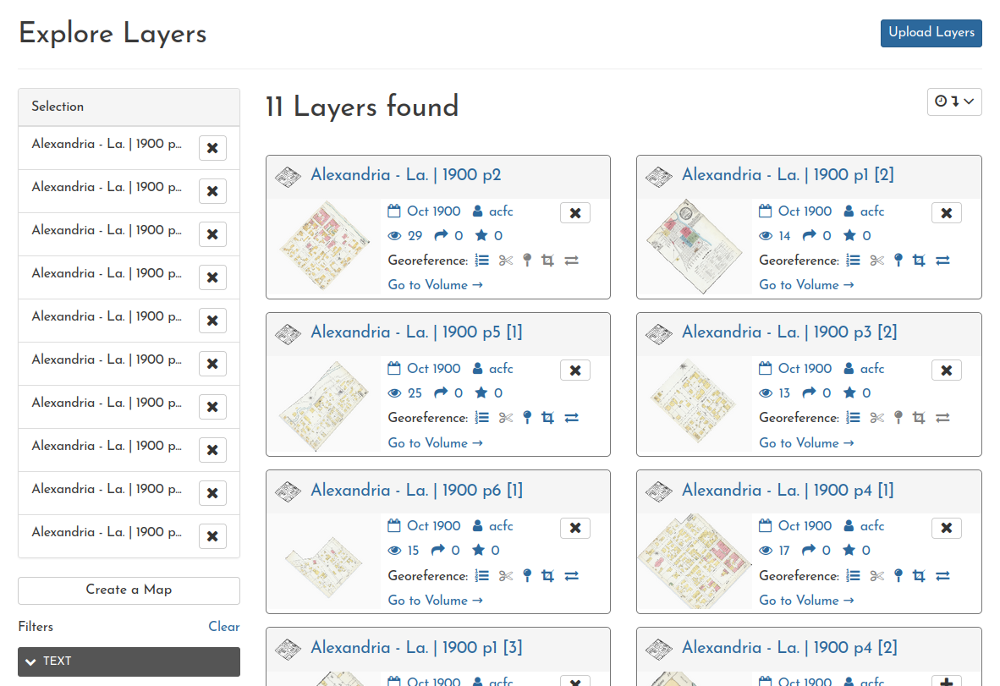
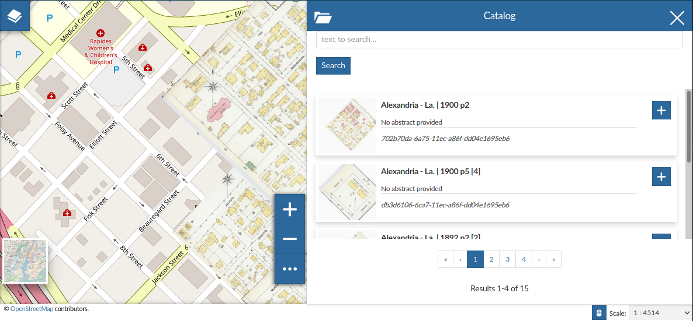

# Overview of Steps

In this application, the entire georeferencing process comprises three sequential steps, each with its own tool interface:

1. [Preparation (Splitting)](#preparation-splitting)
2. [Georeferencing](#georeferencing)
3. [Trimming (optional)](#trimming)

These steps need to be completed in order, but they don't have to be completed all in one sitting. In fact, Georeferencing and Trimming can be revisited at any time, so you can improve on your past work, or build from someone else's.

Tips for using each tool accompany its interface, and similar content is presented below as well.

When you are ready, you can [create a web map](#creating-web-maps) from layers that have been georeferenced.

# Preparation (Splitting)

=== "Basic concept"
	Before a Document can be georeferenced, it must be visually evaluated to determine whether it contains more than one part of town in it. If it does, each of these parts must be split into separate Documents.

=== "Tell me more..."
	When an image is georeferenced, as you'll see below, control points are made that link pixel coordinates on the image with latitude/longitude coordinates on the earth. This means that a set of control points must only be linked to a specific geographic area, i.e. a single file.

### Background

Sometimes an old map document will cover discontiguous areas, especially when the mapmakers were trying to 
fit a lot of content into a single page. In these cases, each separate area in the original document must be split into
its own new document, so that each area can be georeferenced on its own. Typically, you'll find
**strong black lines** delineating different parts of the map. The document must be split along those lines.

	<figure style="width:33%; padding:10px; text-align:center;">
		
		<figcaption style="font-style:italic; font-size:.85em;">This map must be split into four new documents.</figcaption>
	</figure>
	<figure style="width:33%; padding:10px; text-align:center;">
		
		<figcaption style="font-style:italic; font-size:.85em;">This map must be split into two new documents.</figcaption>
	</figure>
	<figure style="width:33%; padding:10px; text-align:center;">
		
		<figcaption style="font-style:italic; font-size:.85em;">This map shows only one part of town, so it should not be split.</figcaption>
	</figure>

### Using the Interface

If this document **does not** to be split:

- Click <code>No Split Needed</code>.
- You will be redirected to the document detail page, from which you can continue the georeferencing process.
- If you chose this by mistake, you can undo the designation in the document detail page.

If this document **does** need to be split

- Use the interface to create as many cut-lines as are needed to fully split this document.
- Once you have one or more valid cut-lines, a preview will appear showing how the image will be split.
- Click <code>Split</code> when you are ready.
- You will be redirected to the document detail page, while the split process runs in the background.
- If you split the document incorrectly, you can undo the process in the document detail page.

Fixing an incorrect determination:

- In the document detail page, you can undo this operation as long no georeferencing has been performed.
- Look for the undo <i class="fa fa-undo"></i> button under the <code>Preparation</code> heading.
- If the button is disabled but you believe the split process was performed incorrectly, please contact an admin.

Creating cut-lines:

- In <code>Draw</code> mode, click once to start or continue a line, and double-click to finish it.
- Press <code>Esc</code> to cancel an in-progress drawing.
- Switch to <code>Modify</code> mode to change a cut-line.
- Click <i class="fa fa-refresh"></i> to erase all lines and start over.

Understanding cut-lines:

- Once you have a valid cut-line, a preview will appear showing you how the document will be split.
- Only cut-lines that fully cross a segment of the document will be used&mdash;all others will safely be ignored.
- Cut-lines can intersect or extend from each other to handle complex shapes.

# Georeferencing

=== "Basic concept"
	"Georeferencing" is the process that is needed to overlay a scanned historical map onto a modern web map, and it must be performed for each Document individually.

=== "Tell me more..."
	Georeferencing works by using "ground control points" to embed geospatial information into an image file and turn it into a geosptial dataset. A ground control point consists of two coordinate pairs: one pair that represents the XY pixel location on the document, and a corresponding latitude/longitude coordinate that represents a point on earth.

### Background
  
Use this interface to create the **ground control points** that will be used to georeference this document. creating a ground control point requires two clicks&mdash;once in the left panel and once in the right. This records a linkage between a spot on the original map document and the real-world latitude/longitude coordinates for that location.

  
In the example image above, 3 control points have been made using street intersections. You can make as many control points as you want (the more the better!) but often 3-6 are enough. If 3 or more are present, a semi-transparent live preview will be added to the right panel. Use the <code>w</code> key to toggle preview transparency.
  
### Using the Interface

_Before starting, it can be helpful to pan and zoom around to become familiar with the document and the area._

Creating a control point:
  
- Start a control point by clicking on the map document (left).
- Finish it by clicking on corresponding location in the web map (right).
- You can pan and zoom in both panels during this process.
- You can add a note to a control point. This is helpful if you are not 100% confident in your placement, or just want to point something out to future users.
- You can modify a control point at any time by clicking and dragging it.
  
Deleting a control point:

- Select an existing control point via the list in the bottom left, or by clicking on it in the panels.
- Click <i class="fa fa-trash"></i> or type <code>d</code> to delete.

Saving Control Points:

- You can only save the control points once you have 3 or more.
- Click <code>Save Control Points</code> when you are satisfied. This will start the warping process, which may take a few minutes to complete. You will be redirected back to the Document detail page in the meantime.
- Click <i class="fa fa-refresh"></i> to reset the interface. This will remove all changes you have made.

Editing existing control points:

- If someone else has already georeferenced this document, feel free to modify their control points (or add more), to improve the georeferencing&mdash;this is meant to be an iterative process.
- Click <i class="fa fa-refresh"></i> to discard your changes and restore the original control points.

Managing layers:

- You can change the opacity of the preview layer by typing <code>w</code>.
- You can switch to an aerial imagery basemap with the <code>Basemap</code> dropdown menu.

Managing the panels:

- You can increase the size of the left or right panel with the menu in the top left.
- Checking the <code>autosize</code> box will cause the panels sizes to dynamically update based on whether your next click should be in the left or right panel.

Transformations:

- It is recommended that you use the default transformation, <code>Polynomial</code>.
- Switching to <code>Thin Plate Spline</code> will allow the image to distort and warp to fit all control points exactly, which _could_ be necessary in rare circumstances.
- You can read more about GDAL transformation algorithms in the <a href="https://docs.qgis.org/3.16/en/docs/user_manual/working_with_raster/georeferencer.html#available-transformation-algorithms" target="_blank">QGIS documentation <i class="fa fa-external-link"></i></a> (note: we are only using the Polynomial 1 transformation here).

Tips:

- Prioritize finding control points that are widely spread across the map.
- Look for locations that have changed the least over time. For example, the center of street interections, railroad crossings, or, in some cases, the corners or centers of old buildings.
- Locations to avoid using are the edges of city blocks, sidewalks, or street intersections of which you can only see a portion.
- Historical maps may have mistakes, or street names may have changed over time.
  

# Trimming

=== "Basic concept"
	You can trim the edges of a border layer away so that adjacent sheets on the same web map don't obscure each other.

=== "Tell me more..."
	This process is accomplished by creating a polygon "mask" that is used to crop extraneous layer content. These mask coordinates are written into an alternate layer style that is set as the new default for the Layer. This approach preserves the original style, which allows users switch back to the full style if they want to see the entire image in a web map.

### Background

To use our georeferenced layers most effectively, we can combine them in web maps to create a seamless mosaic. However, this often causes adjacent images to overlap and obscure each other. Consider the example below, where the layer on the left covers up the edge of the layer on the right.

To reduce this overlap, we can trim the edges of the left layer by creating a mask. This is just a shape that will cause everything outside of it to be clipped away. The result can look like this:

The mask polygon is stored as a new trim style for the layer, and set as the default style. The layer itself is not changed, however, so don't worry about altering any underlying data through this process.

### Using the Interface

Creating a new mask:

- Click on a corner of the layer to begin creating the polygon.
- Click again at each corner to continue.
- Double-click on the final corner to finish the polygon.
- The layer will be automatically be clipped when the polygon is finished.

Adjusting the mask:

- Click and drag anywhere on the polygon to modify it.
- Click <i class="fa fa-refresh" title="Reset interface"></i> to reset the polygon.

Altering an existing mask:

- If someone else has already created a mask for this layer, but it needs to be changed, go for it&mdash;this is meant to be an iterative process.
- Click <i class="fa fa-refresh" title="Reset interface"></i> to restore the mask to how you found it.
- Click <i class="fa fa-trash" title="Remove mask"></i> to remove the mask altogether from this layer.

Tips:

- It may be easiest to outline the layer first and then zoom in to make more subtle changes.
- The live clipping preview may leave some extraneous piece of the layer outside the mask. You can disregard this.
- When viewing a trimmed layer in a web map (as shown above) you may see a <code style="color:red;">!</code> next to the layer name. This can be ignored.

# Creating Web Maps

=== "Basic concept"
	Users can author their own Web Maps, and add whichever layers they want to them. This is most obviously useful for aggregating all of the layers for a single city in a single year, but you could also combine layers from different years.

=== "Tell me more..."
	Creating Web Maps is a core GeoNode functionality, and this project only scratches the surface of what these maps can do. Please see the [GeoNode documentation](https://docs.geonode.org/en/master/usage/managing_maps/index.html) to learn more. _Please note: In GeoNode parlance, what we refer to here as **Web Maps** are simply called **Maps**._

The easiest way to create a web map is to start in the main [layers search page](https://oldinsurancemaps.net/layers). Here you can use some search criteria to find the layers you are interested in, select all of the layers you want with the <i class="fa fa-plus"></i> button, and then click **Create a Map**.

This web map will be visible to anyone and embedded into other websites, and if you view it on a mobile device you can add your current location.

## Adding Layers to an Existing Web Map

You can also add layers to an existing web map. In the top right corner, you'll find the **Catalog** button. This use this list to find and add other layers.

If you are creating a map to cover an entire large city, this strategy will likely be your only course of action.