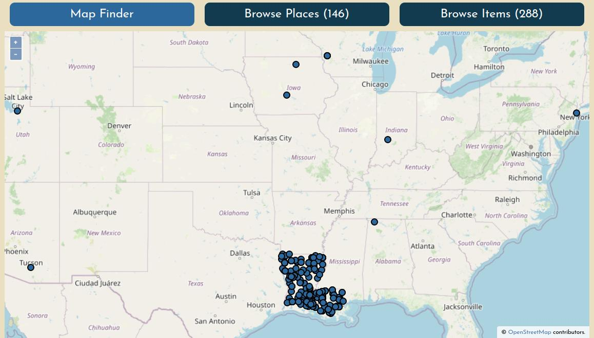
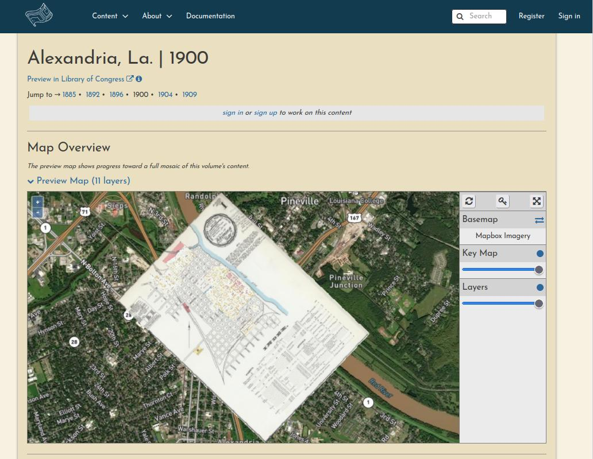
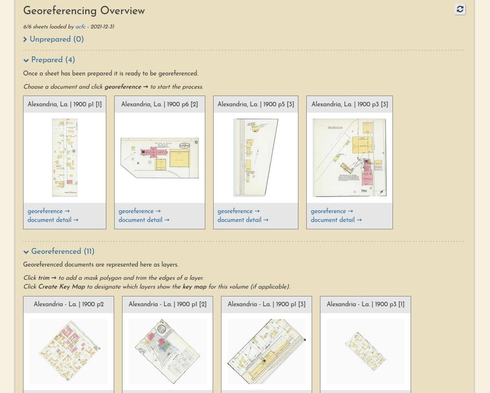

# Overview

## Sign up to begin georeferencing

All you need to do to begin contributing on _OldInsuranceMaps.net_ is create an account. You must agree that any contributions you make will be licensed [CC0](https://creativecommons.org/public-domain/cc0/) ("No Rights Reserved"), meaning that your work is effectively in the public domain. See the [Data Agreement](https://oldinsurancemaps.net/data-agreement) for more details about this.

## How the site is structured

You can browse content in the platform by map, by place name, or by map name. To learn more about these search methods, see [Finding maps](./guides/finding-maps.md).

Each maps's summary page has an interactive Mosaic Preview showing all of the sheets that have been georeferenced so far.

Each maps's summary page also lists the progress and georeferencing stage of each sheet.

Finally, each resource itself has its own page, showing a complete lineage of the work that has been performed on it by various users.

![Alexandria, La, 1900, p1 [2]](../images/example-resource-alex-1900.jpg)

## Understanding the georeferencing workflow

The georeferencing process generally consists of three operations, each with their own browser interface.

### Preparation

Document preparation (sometimes they must be split into multiple pieces):

Learn more in [this guide](../guides/preparation.md).

### Georeferencing

Ground control point creation (these are used to warp the document into a geotiff):

Learn more in [this guide](../guides/georeferencing.md).

### Trimming

And a "multimask" that allows a volume's sheets to be trimmed *en masse*, a quick way to create a seamless mosaic from overlapping sheets:

Learn more in [this guide](../guides/trimming.md).

## Full walkthrough

For a full illustrated demonstration of how these steps fit together across a whole multi-page Sanborn atlas, checkout the [New Iberia, La. 1885 walthrough](../walkthroughs/new-iberia-la-1885.md).

## Work Sessions

All user input is tracked through registered accounts, which allows for a comprehensive understanding of user engagement and participation, as well as a complete database of all input georeferencing information, like ground control points, masks, etc.

You can always see the most recent sessions on the [activity page](https://oldinsurancemaps.net/activity).
