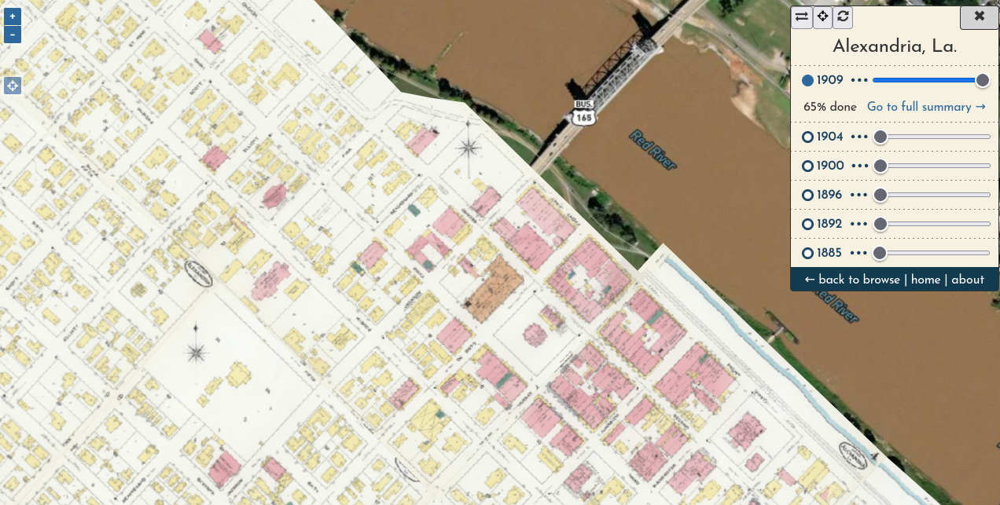

# Using the viewer

!!! warning

    **It is easy to over-interpret georeferenced historical maps**, because they may contain factual mistakes (yes, even the Sanborn Map Company isn't perfect) or they may be distorted or misaligned when compared to aerial imagery. Please keep this in mind when using this site!

The viewer aggregates all content for a given place, presenting each volume's content in a single mosaicked layer. You can turn on each layer by clicking the year (or circle by the year) and you can fine-tune each layer's opacity with the slider.

As you pan the map and adjust layers, your browser URL will be updated to reflect your current view. This means that if you copy the URL at any point, whoever you share it with will see exactly what you are seeing. This allows you to share very specific parts of history, like the [Winter Quarters of M.L. Clark's Circus in 1900](https://oldinsurancemaps.net/viewer/alexandria-la/?sanborn03267_006=0&sanborn03267_005=0&sanborn03267_004=100&sanborn03267_003=0&sanborn03267_002=0&sanborn03267_001=0#/center/-92.45465,31.31151/zoom/20.5).

Use the "locate me" button  to place your current position on the map (best to do this on a mobile device while you are walking though a town in Louisiana!).

Click the **•••** by any year to see the percentage of its content that has been georeferenced, or head to the more detailed summary of its progress. This percentage is presented here primarily to make clear when a mosaicked layer is incomplete; generally there will be at least a few pieces of a Sanborn map that are too difficult to locate and will likely never be georeferenced. You can still view these piece in the volume summary, however.