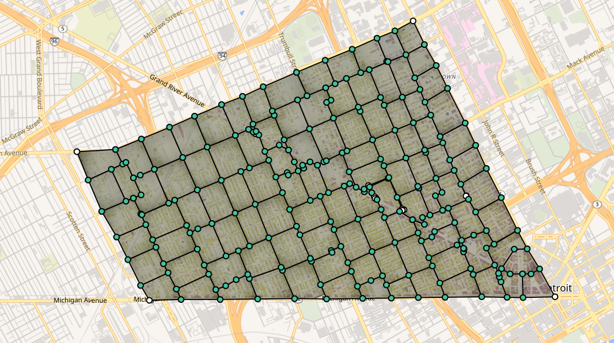
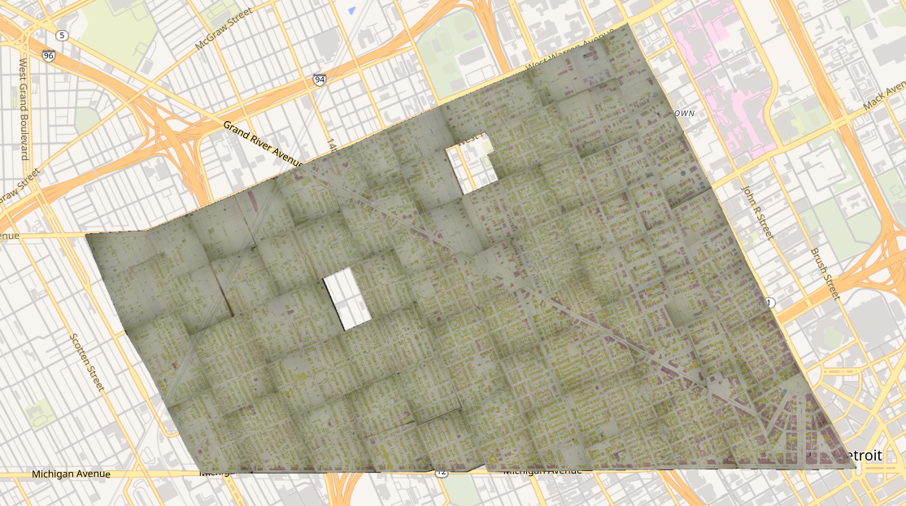
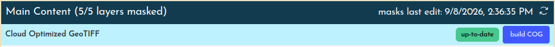
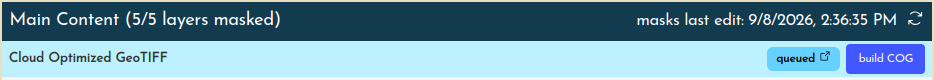
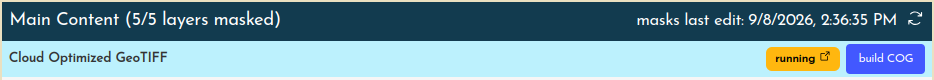

# Generating mosaics

## Understanding mosaic "derivatives"

Once layers are grouped into layersets, and each layerset is trimmed in the [MultiMask](./trimming.md) interface, the final step is to collapse the content into a single mosaic per layerset, like finally glueing down all the individual clippings in a collage.

This screenshot of [Detroit, Mich., 1897, vol. 2](https://oldinsurancemaps.net/map/sanborn03985_005), shows 106 individual layers that have been georeferenced and masked. Creating a derivative from this mosaic produces a single layer, in this case a Cloud Optimized GeoTIFF.

This greatly improves the utility of what you have created by allowing you to do things like:

- Download a single mosaic file for an entire volume
- Load a single layer of the entire volume into web applications like HistoryForge or OpenHistoricalMap

It also speeds up parts of OIM that use mosaic derivatives when they are available.

## Accessing derivatives

Within within a map's **Mosaic** &rarr; **Derivatives** (see [New Iberia, 1885](https://oldinsurancemaps.net/map/sanborn03375_001#mosaic)) section you'll find a list of all "layersets" within that map (usually just Main Content, but other categories could appear here as well if they have more than one layer).

Currently, OIM supports the creation of two different derivatives per layerset:

- **Cloud Optimized GeoTIFFs (COG)**
    - This is the primary output, and when present, is used within OIM in certain contexts
- **XYZ Tileset**
    - This is a rendering of the latest COG mosaic to actual PNG tiles in a {z}/{x}/{y}.png folder structure

These two formats, in turn, allow us to provide other formats and web services as well.

!!! note

    You may be wondering what happens to Key Maps and other categories of maps, i.e. other layersets. Though these are handled on the backend exactly like the Main Content layerset, they are only shown in the derivatives list if they have more than one layer.

## Keeping derivatives up-to-date

The creation of a single geotiff (or static XYZ tileset) is effectively a snapshot of the work that has been performed on a map's layers and masks up to that point. The derivatives list will show a timestamp for the last time an edit was made to the multimask, as well as a small status tag for each format showing the status of its last mosaic job.

### `up-to-date`

A derivative is **up-to-date** when there has been no updates to the multimask or layers since it was created. You can hover the tag to see when it was last run.

### `stale`

If a derivative is marked as **stale**, that means that the masks or layers used to create it have been changed since the last job was run. In this case you can click the **build COG** button to queue the re-creation of this derivative.

!!! note

    Because **XYZ Tilesets** are generated _from_ COGs, the COG derivative must be up-to-date, or queued, before you will be able to queue the creation of a tileset.

### `queued`

Because the process to create a COG (or XYZ tileset) from dozens or hundreds of layers can take several hours, we use a **queueing** system to ensure the server is never overloaded. Queued mosaic operations are processed with a first in, first out policy. You can see the status of mosaicking processes (queued, running, or completed) in [Jobs](https://oldinsurancemaps.net/jobs).

### `running`

Once a job has been picked up by a runner, it will change from queued to **running** for as long as the process takes, eventually returning to **up-to-date** when the process is completed.

## How long does it take for a job to complete?

This depends on the layerset itself, and which format of derivative you are creating.

- COG: The greater the **geographic extent** of all layers (imagine drawing a big rectangle that encompasses **all** of the layers in the layerset), the longer the job (and larger the resulting file).
- XYZ Tileset: The greater the **geographic coverage** of all layers in the mosaic (imagine all of the mask boundaries dissolved into a big polygon, or multi-polygon), the longer the job (and higher the number of tiles in the tileset).
