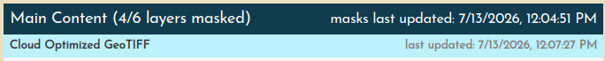
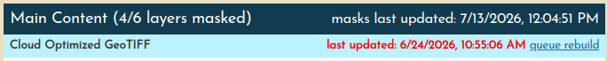

# Generating mosaics

Once layers are grouped into layersets, and each layerset is trimmed in the [multimask](./trimming.md) interface, the final step is to collapse the content into a single mosaic per layerset, like finally gluing down all the individual clippings in a collage. You'll find these within within a map's **Mosaic** &rarr; **Derivatives** (see [New Iberia, 1885](https://oldinsurancemaps.net/map/sanborn03375_001#mosaic)).

Currently, OIM supports the creation of two different derivatives per layerset:

- **Cloud Optimized GeoTIFFs (COG)**
    - This is the primary output, and when present, is used within OIM in certain contexts
- **Static XYZ Tileset**
    - This is a rendering of the latest COG mosaic to actual PNG tiles in a {z}/{y}/{x}.png folder structure.

!!! note

    You may be wondering what happens to Key Maps and other categories of maps, i.e. other layersets. Though these are handled on the backend exactly like the Main Content layerset, they are only shown in the derivatives list if they have more than one layer.

## Keeping derivatives up-to-date

The creation of a single geotiff (or static XYZ tileset) is effectively a snapshot of the work that has been performed on a map's layers and masks up to that point. Timestamps are displayed showing when masks were last updated, and when derivatives were last generated.

However, this means that if the ground control points are subsequently updated for a layer, or the masks are adjusted, the derivative artifact will be out-of-date. In this case, the interface will show timestamps of out-of-date artifacts in red and a button will be available allowing you to queue this artifact to be rebuilt.

Because the process to create a single geotiff (or xyz tileset) from dozens or hundreds of layers can take several hours, we use a queueing system to ensure the server is never overloaded. You can see all mosaicking processes (queued, running, or completed) in [Jobs](https://oldinsurancemaps.net/jobs).

In the current setup, only two jobs are allowed to run at any time, and queued mosaic operations are processed with a first in, first out policy.
