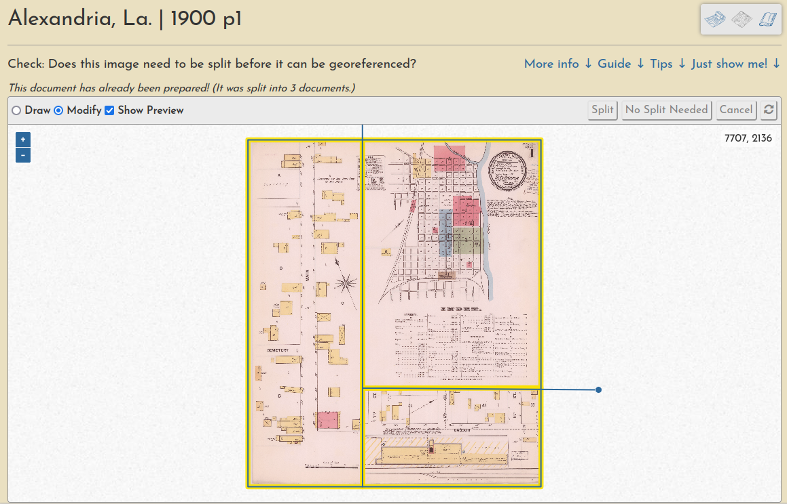

# Understanding the georeferencing workflow

The georeferencing process generally consists of three operations, each with their own browser interface.

## The steps at a glance

### Preparation

Document preparation (sometimes they must be split into multiple pieces):

Learn more in [this guide](../guides/preparation.md).

### Georeferencing

Ground control point creation (these are used to warp the document into a geotiff):

Learn more in [this guide](../guides/georeferencing.md).

### Trimming

And a "multimask" that allows a volume's sheets to be trimmed *en masse*, a quick way to create a seamless mosaic from overlapping sheets:

Learn more in [this guide](../guides/trimming.md).

## Full walkthrough

For a full illustrated demonstration of how these steps fit together across a whole multi-page Sanborn atlas, checkout the [New Iberia, La. 1885 walthrough](../walkthroughs/new-iberia-la-1885.md).

## Work Sessions

All user input is tracked through registered accounts, which allows for a comprehensive understanding of user engagement and participation, as well as a complete database of all input georeferencing information, like ground control points, masks, etc.

You can always see the most recent sessions on the [activity page](https://oldinsurancemaps.net/activity).
