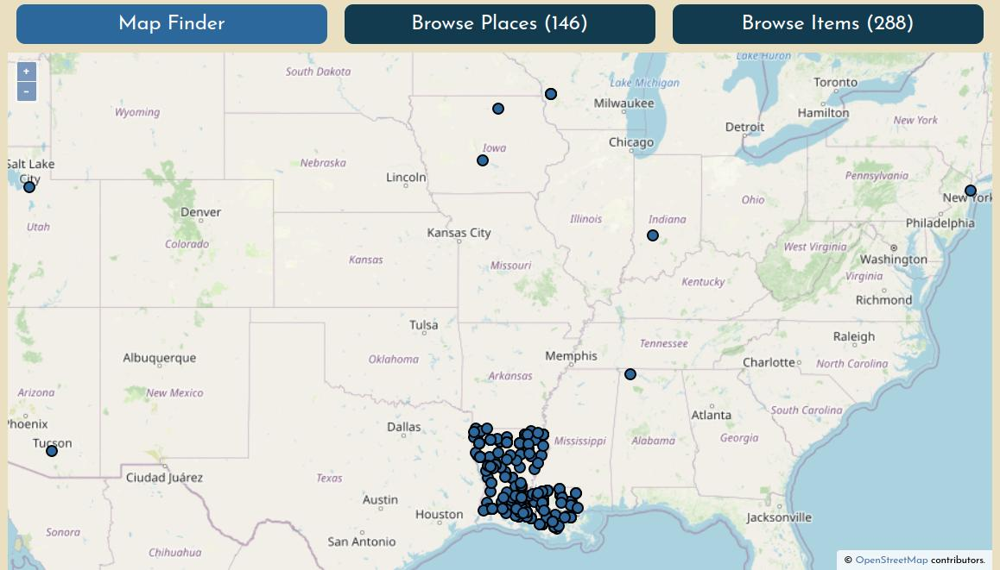
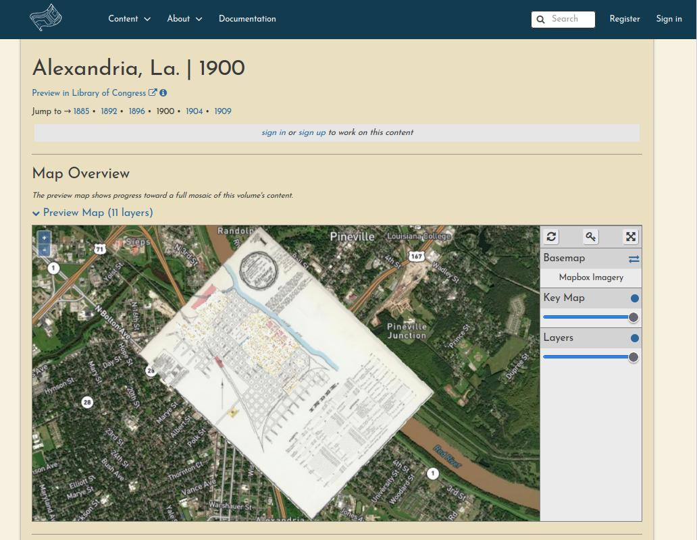
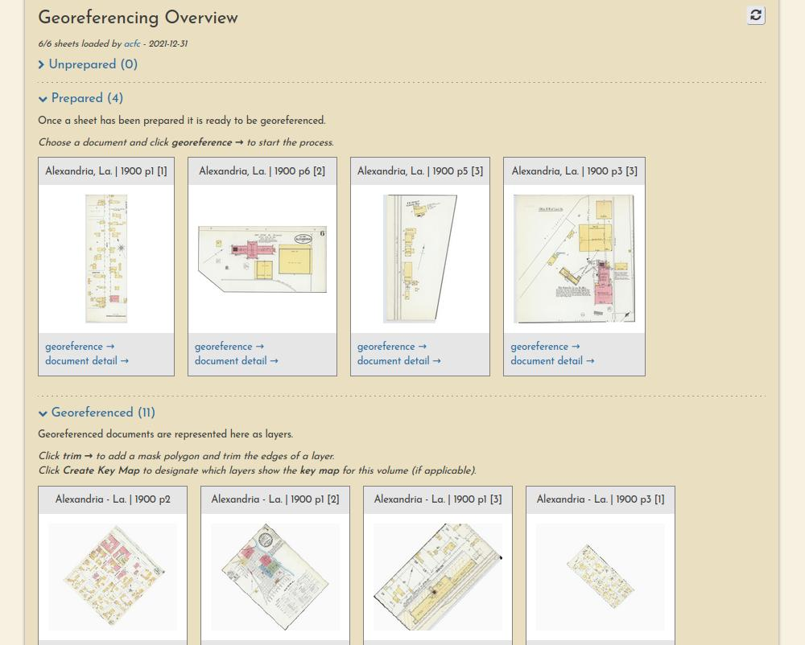

# Welcome!

This documentation site will help you understand [OldInsuranceMaps.net](https://oldinsurancemaps.net), crowdsourcing platform for creating and viewing georeferenced mosaics of historical fire insurance maps, primarily from the Library of Congress [Sanborn Maps collection](https://loc.gov/collections/sanborn-maps).

## Quick links

- [OldInsuranceMaps.net](https://oldinsurancemaps.net) - The main platform and georeferencing application.
- [Online Historical Map Georeferencer (OHMG)](https://ohmg.dev) - Information about the concepts and open source software behind this project, including architecture and installation docs.
- [OpenHistoricalMap Forum &rarr; OldInsuranceMaps.net](https://forum.openhistoricalmap.org/c/oldinsurancemaps/13) - Drop by to introduce yourself, and feel free to ask questions about the project and how people are using it.

## Site Overview

You can browse content in the platform by map, by place name, or by map name. To learn more about these search methods, see [Finding maps](./guides/finding-maps.md).

Each volume's summary page has an interactive Map Overview showing all of the sheets that have been georeferenced so far.

Each volume's summary page also lists the progress and georeferencing stage of each sheet.

Finally, each resource itself has its own page, showing a complete lineage of the work that has been performed on it by various users.

![Alexandria, La, 1900, p1 [2]](images/example-resource-alex-1900.jpg)
