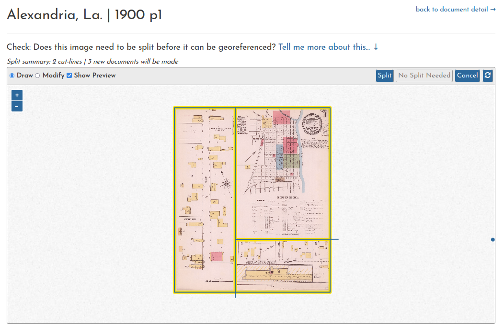
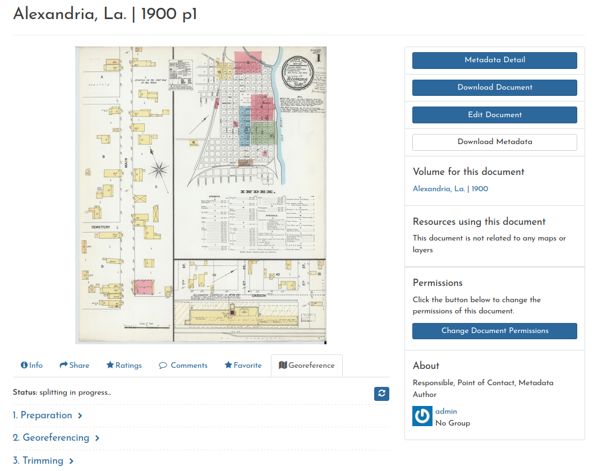
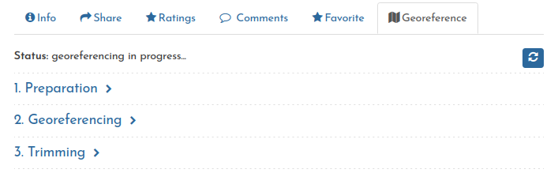
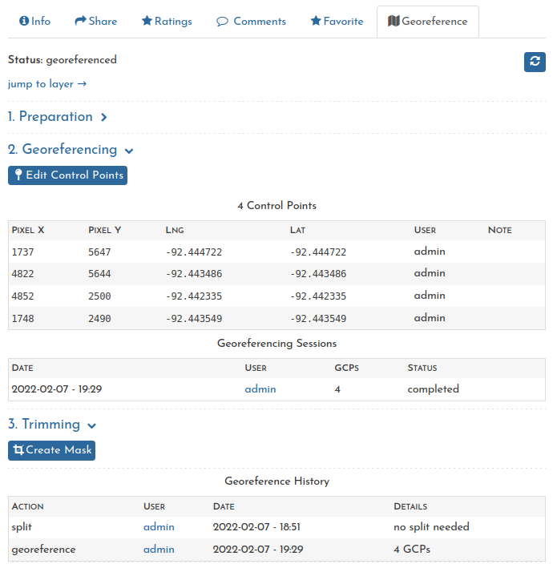

# Alexandria, La., 1900 (old tutorial for multi-page Sanborn map)

!!! Warning
    
    Some changes have been made throughout the site since this tutorial was first created. Some of the screenshots and navigation paths are out-of-date, and the "Load the Volume" step is no longer supported. Otherwise, the gist of the workflow is the same.

This tutorial covers the entire process using the [Alexandria, La. | 1900](https://www.loc.gov/resource/g4014am.g032671900/?st=gallery) volume as an example.

The complete workflow is:

1. [Load the Volume](#load-the-volume)
2. [Prepare the Documents](#prepare-the-documents)
3. [Georeference the prepared Documents](#georeference-the-prepared-documents)

Keep in mind that these steps are designed to facilitate a collaborative environment. While you *could* complete an entire volume in one session, you can also just do individual steps here and there, allowing others to fill in around. Georeferencing (3 above) is an iterative process, so you can come back later to improve upon your own work, or someone else's.

The end result is a web map which can be viewed in the site or embedded with an `<iframe>` on any web page. Also, any of the individual layers can be used in other web maps or geospatial software (as WMS).

## Load the Volume

From the [Volumes page](https://oldinsurancemaps.net/browse), we begin by finding the city and year we are interested in.

Selecting the 1900 volume, we are brought to the **volume summary** page.

When we click **Load Sheets**, the files begin to load and are presented in the "Unprepared" section of the summary.

As the sheets load, you can click the refresh button (or reload the page) and newly loaded sheets will appear. After one sheet is ready, we can go ahead and prepare it. The other sheets will continue to load in the background.

## Prepare the Documents

The preparation step requires a judgment to be made as to whether
    
1. the sheet shows only **one area**, or
2. the sheet shows **multiple areas**
    
In the case of 1, then preparation just takes one button click and the sheet can be georeferenced immediately. In the case of 2, the sheet must be split into smaller pieces, so that each one can be georeferenced independently.

### Scenario 1 - No Split Needed

We'll click **prepare** on sheet 2, and we are brought to the splitting interface.

In this case, all we need to do is click **No Split Needed**, and this sheet will be marked as "prepared". We'll be taken straight to the georeferencing interface.

For now, instead of georeferencing (which we'll do soon enough) let's return to the volume summary.

**back to document detail &rarr; Volume for this document**

or

**Content &rarr; Volumes &rarr; Alexandria 1900**

### Scenario 2 - Split

Now we'll click **prepare** on sheet 1.

In this case, it's clear that the sheet has three different sections, delineated by **thick black lines**. We'll draw two "cut-lines" along the section boundaries, and a yellow preview will show us how the sheet will be divided up.

Once everything looks good, clicking **Split** will run the process, and redirect us to the **Georeference** tab in the document detail page.

When the split is complete, we can see the new documents in this tab.

Once completed, we'll head back to the volume summary to check our progress.

As expected, there are now 4 documents that are ready to be georeferenced, i.e. "prepared". The first three are the result of splitting sheet 1, and the fourth is sheet 2, which did not need to be split. We'll leave the 4 "unprepared" documents for now, and move on to georeferencing. 

## Georeference the Prepared Documents

Again, we'll start with sheet 2. Clicking **georeference &rarr;** brings us to the georeferencing interface.

We'll use street intersections as the basis for our control points. After we make 3 of them, a preview shows up and we can begin a closer inspection of our results.

Looks pretty good! But if needed, we can click and drag either of these points closer to the center of the intersection.

Once we have 4 points, we can click **Save Control Points** to run the georeferencing process.

As with the Split process, we'll be brought to the **Georeference** tab in the document detail page.

Once the process has completed (again, we can use the refresh button to get updates), we'll be shown list of all the control points we made.

---

At this point, we can repeat the processes for all other sheets and documents in the volume. Keep in mind: some small pieces of Sanborn maps may be impossible to georeference if they only show a few buildings and don't have any present-day context to georeference them against.

Also, because these processes run in the background, once you are familiar with the system you'll find you can move through them quite quickly.
