# New Iberia, La., 1885 | Multi-page Sanborn Map

This walkthrough illustrates the georeferencing and mosaicking process from start to finish for a single Sanborn map edition. It should be helpful not only as a point of reference while doing this work yourself, but also as a general (though not comprehensive) demonstration of the platform's capabilities.

The map for this walkthrough, [New Iberia, La., 1885](https://www.loc.gov/item/sanborn03375_001/), is a Sanborn map with only 3 sheets, but it should be pretty easy to imagine how this process would scale to 50 or 100 sheets.

As a reminder, the main source of content in _OldInsuranceMaps.net_ is the digital [Sanborn Maps collection](https://www.loc.gov/collections/sanborn-maps/) at the Library of Congress, in which this map of New Iberia looks like this:

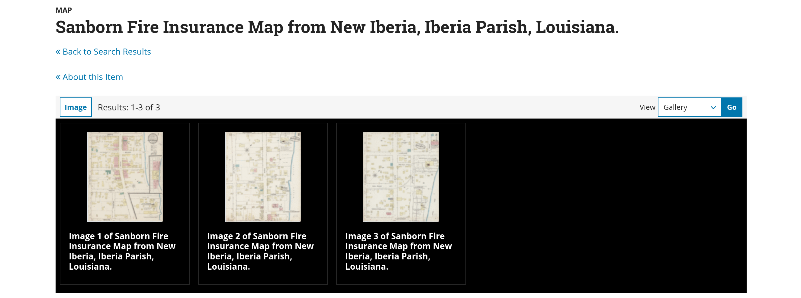

Through the process shown below, these pages will be georeferenced and stitched together, creating a seamless mosaic. This mosaic can be downloaded as a GeoTIFF or, via XYZ or WMS web services, used in web applications or desktop GIS software.

## Overview

Broadly speaking, here is the recommended approach:

1. [Find the map in the system](#find-the-map)
1. [Load the documents](#load-the-documents)
1. [Prepare the documents](#prepare-the-documents)
2. [Georeference and classify the "key map"](#georeference-and-classify-the-key-map)
4. [Georeference all other layers](#georeference-the-remaining-content)
5. [Trim all the layers in the "MultiMask"](#trim-the-layers)
6. [Make the final mosaic](#make-the-mosaic)

Keep in mind: All of the steps within this workflow are very modular, and can be carried out by one person in one sitting, or by many people over the course of multiple days (or weeks or months!).

!!! info

    You will need to create a free account on [OldInsuranceMaps.net](https://oldinsurancemaps.net) in order to get started. That's all!

## Find the map

While this action is better covered in the [finding maps](../guides/finding-maps.md) page, one helpful trick is that every place or "locale" within the platform (state, county/parish, city/town, etc.) can be accessed directly with a regularized URL pattern. Consider the following rules, with all letters lowercase and all spaces replaced with hyphens:

- Maps within a state
    - `https://oldinsurancemaps.net/<state name>`
    - Example: [oldinsurancemaps.net/louisiana](https://oldinsurancemaps.net/louisiana)
- Maps within a county (or parish in Lousiana)
    - `https://oldinsurancemaps.net/<county name, state postal code>`
    - Example: [oldinsurancemaps.net/iberia-parish-la](https://oldinsurancemaps.net/iberia-parish-la)
    - Example: [oldinsurancemaps.net/vernon-county-wi](https://oldinsurancemaps.net/vernon-county-wi)
- Maps of a city/town
    - `https://oldinsurancemaps.net/<city/town name, state postal code>`
    - Example: [oldinsurancemaps.net/new-iberia-la](https://oldinsurancemaps.net/new-iberia-la)

In this case we head to [oldinsurancemaps.net/new-iberia-la](https://oldinsurancemaps.net/new-iberia-la). Ypou just check the **show all** box to display maps that are in the system but have not yet been started.

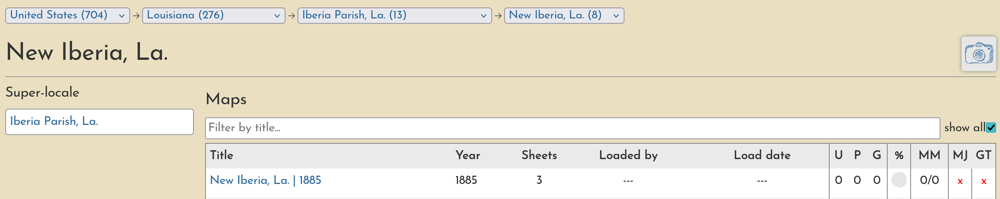

Clicking the map title will navigate to the overview page for this map. It's a good idea to bookmark this page, as it is the central place from which all the work on this map will take place.

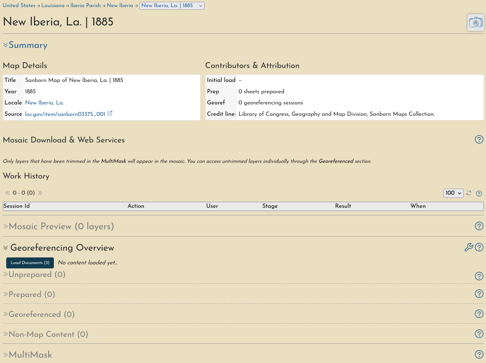

## Load the documents

When a map has been added to the system, an entry is made for it but the actual documents are not yet loaded&mdash;doing so is the first step. In the map overview, within a section called "Georeferencing Overview", there will be a **Load Documents** button.

!!! tip

    If you don't see this button, make sure you are logged in.

Click this button, and the documents will start to load in the background. _You can leave this page and the loading will continue_. Once the first document has loaded we'll see it in the **Unprepared** section.

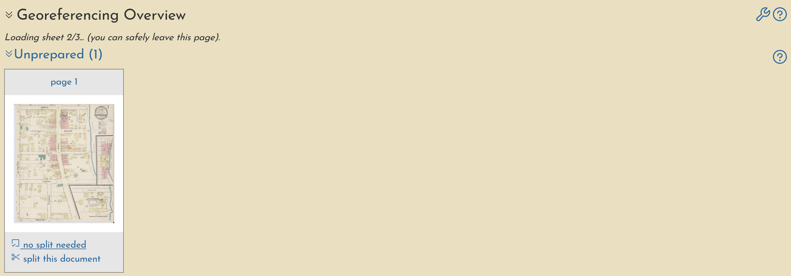

In fact, this first document is an important one, as it has the "key map", so we can begin working with it right away.

## Prepare the documents

In this particular Sanborn Map, there is a "key map" on the first sheet. It is small, and just covers a small portion of the sheet on the right side, but it is helpful to prepare and georeference this map first because it will make later steps easier.

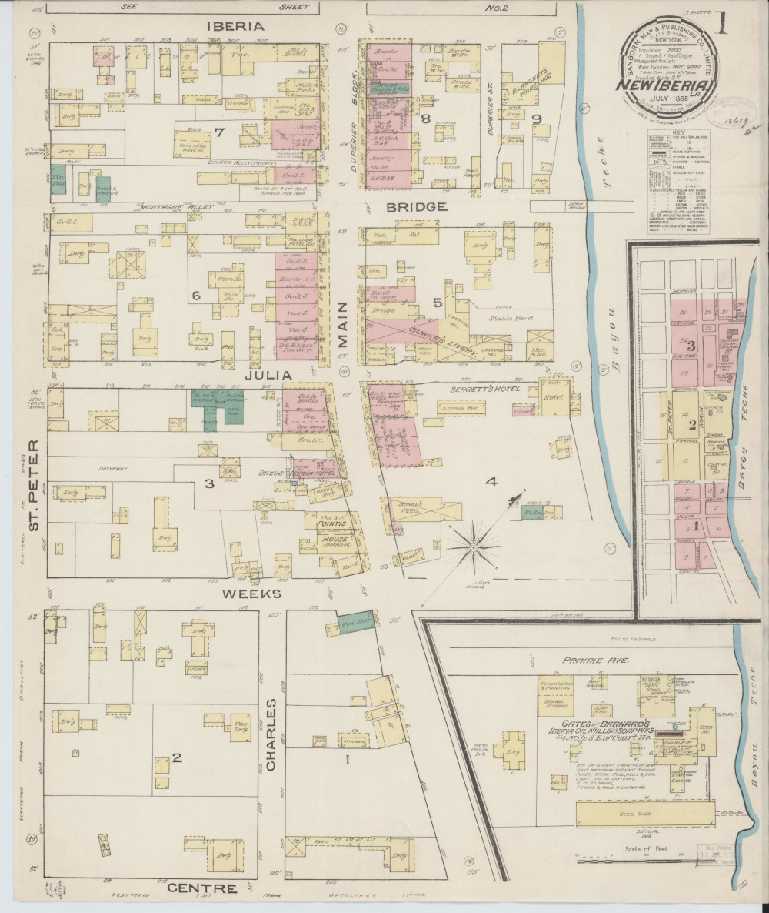

### Splitting documents

With a little visual inspection, we can see that there are dark black lines within this page that separate it into different regions. This sheet must be "split" along these lines so that each region can be georeferenced individually. Clicking the **split this document** link will bring us an interface for doing just that.

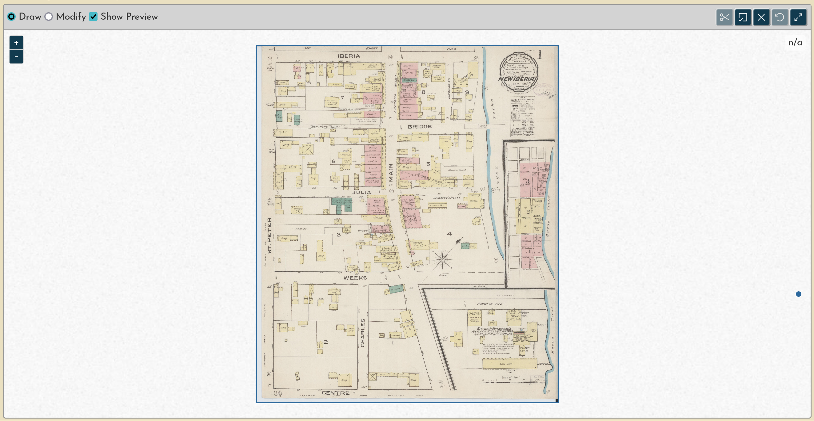

!!! tip

    See [Splitting documents](../guides/preparation.md) for more instruction on how to use this interface.

Once the cut-lines have been drawn, and with the preview clearly showing that three new regions will be created to match the divisions within the page, the process can be started. Click the scissors button to submit these cut-lines.

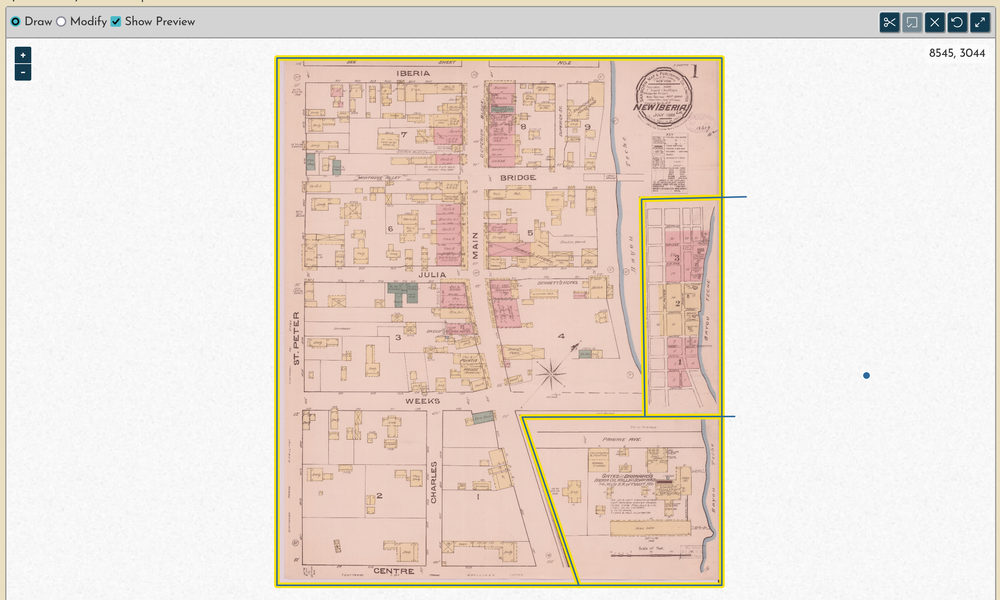

When the split is submitted you will be taken back to the overview page, and after a few seconds, the newly split items will appear in the **Prepared** section, while the original "page 1" has been removed from the **Unprepared** section.

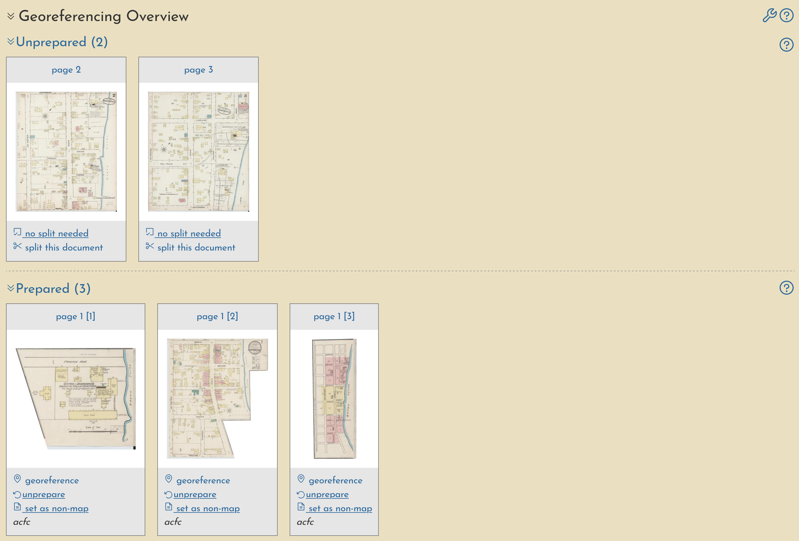

Also, now you can see the remaining two documents have loaded while we were preparing the first one, and they are in the **Unprepared** section.

### No split needed

Preparing these final two pages will be even easier. By looking at them closely we can see that, unlike the first page, they are _not_ divided into multiple regions; each sheet just shows one whole map.

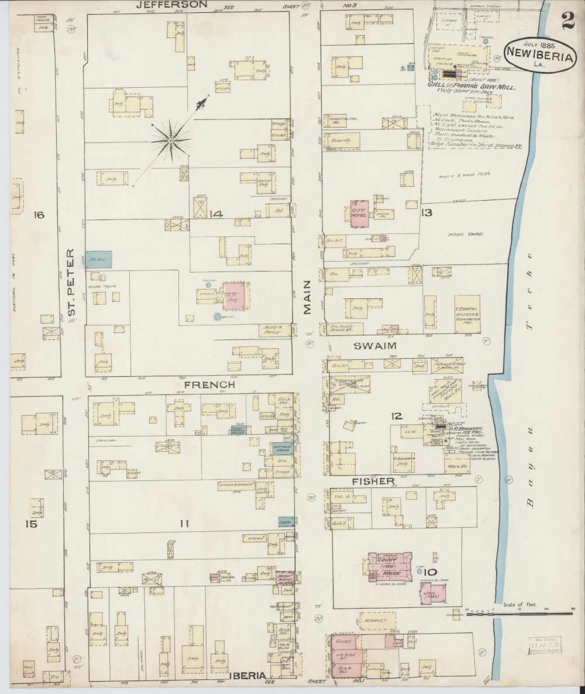{data-gallery="sheets"}

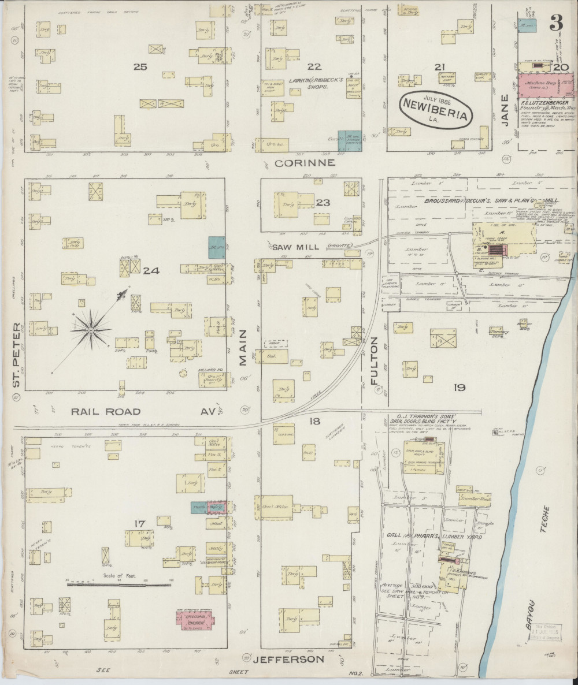{data-gallery="sheets"}

So, for each one we click the **no split needed** button, and they will be moved into the **Prepared** section. Now everything is ready to be georeferenced.

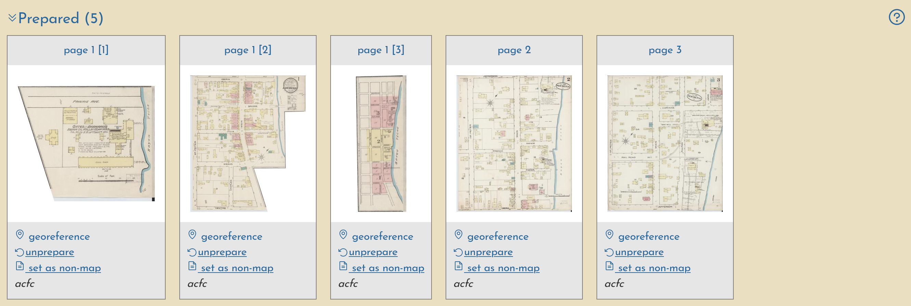

!!! warning

    If you make a mistake, don't worry! You can undo a preparation step by clicking the **unprepare** button. Users can only undo their own work, not that of another user.

!!! tip

    You may be wondering, what is the **set as non-map** button for? Use this designation for non-cartographic content, like title pages, text index pages, etc.

## Georeference and classify the "key map"

One small piece of the first document, **page 1 [3]**, is actually the "key map", a small scale representation of the entire atlas which helps us locate all of the other sheets. It is beneficial to georeference this map first.

Clicking **georeference** on the key map item will navigate to the georeferencing interface.

!!! tip

    See [Georeferencing](../guides/georeferencing.md) for more instruction on how to use this interface.

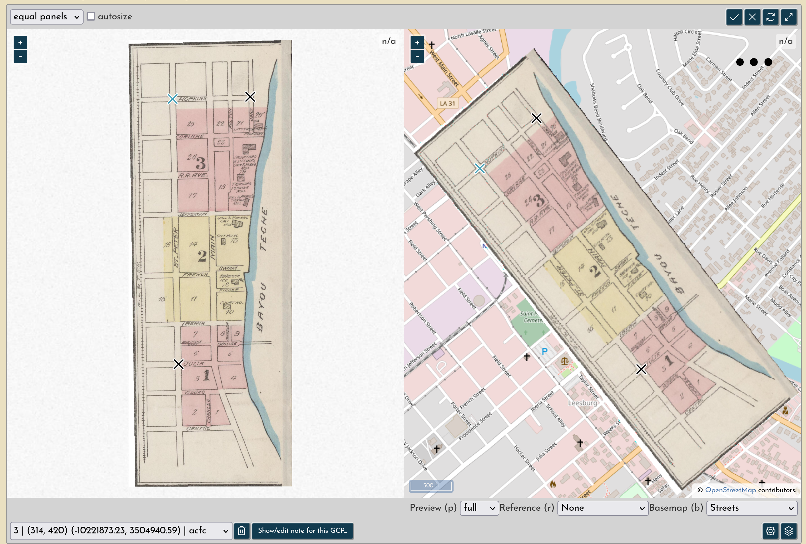

Once you have created three ground control points added to the interface, a preview of the georeferenced map will appear automatically, showing you how it overlays onto today's map. When the preview looks good (i.e. not skewed or distorted, and clearly match today's road network), the georeferencing can be submitted.

After submission, the page will redirect back to the map summary. It may take a few seconds, but once the background process is completed, the newly created layer will now be in the **Georeferenced** section, moved down from the **Prepared** section. Notice, the thumbnail is tilted, now that the layer has been warped.

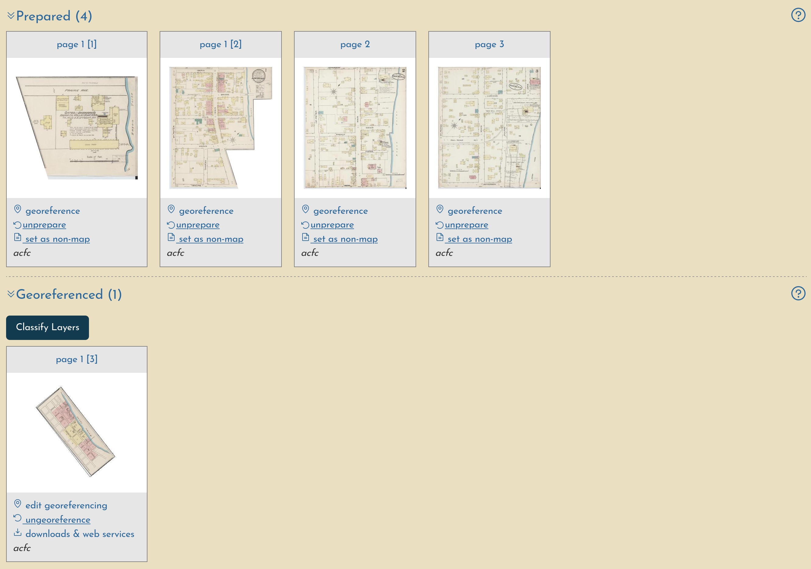

The final step for handling the key map is to click the **Classify Layers** button. This will add a dropdown picker within each layer's card, with which you can change the layer's designation.

By default, all layers are in the **Main Content** category, but in this case we'll change it to **key map** and then click Save.

!!! tip

    Again, keep in mind this is a very small and simple Sanborn map. Other may have different categories of content, or may have key maps on more than one sheet.

## Georeference the remaining content

With the key map now georeferenced and classified, it's time to continue with the other items. We'll start with pages 2 and 3, because they look really easy.

### Key map as reference layer

When we enter the georeferencing interface for page 2, we can see that the key map is now automatically added to the interface as an optional "reference" layer.

This is especially helpful on very large volumes, because it makes it much easier to find the location of the region you are working with. To turn the key map layer off, use the **Reference** dropdown, or the keyboard shortcut "r".

### Other georeferenced content as reference layers

_todo: add this section with the next couple of sheets_

### Very small and difficult pieces

Not everything can, or should, be georeferenced.....

## Trim the layers

Use the MultiMask tool to create mask boundaries around every layer in the "Main Content" category.

## Make the mosaic

Once the MultiMask includes every layer, a single mosaicked GeoTIFF can be created. In the future, this may be automated, but for now, please just email `hello@oldinsurancemaps.net`.

When a mosaic has been made, it will be available for download in the **Summary** section of the map overview page.